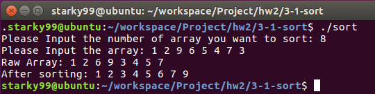

# Project3 Multithreaded Sorting Application

## 问题

> Write a multithreaded sorting program that works as follows: A list of integers
> is divided into two smaller lists of equal size. Two separate threads (which we will term sorting threads) sort each sublist using a sorting algorithm of your
> choice. The two sublists are then merged by a third thread—a merging thread
> —which merges the two sublists into a single sorted list.
> Because global data are shared across all threads, perhaps the easiest way
> to set up the data is to create a global array. Each sorting thread will work on
> one half of this array. A second global array of the same size as the unsorted
> integer array will also be established. The merging thread will then merge the
> two sublists into this second array. Graphically, this program is structured as
> in Figure 4.27.
> This programming project will require passing parameters to each of the
> sorting threads. In particular, it will be necessary to identify the starting index
> from which each thread is to begin sorting. Refer to the instructions in Project
> 1 for details on passing parameters to a thread.
> The parent thread will output the sorted array once all sorting threads have
> exited.

## 实现

用`sort.cpp`实现，需要使用`g++`编译。

```shell
g++ -o sort sort.cpp -lpthread
```

### MergeSort

使用归并排序，需要先实现 `sort()` 和 `merge()`函数。

```cpp
void sort(int low, int high){
	for (int i=low;i<high;i++){
		int tmp=i;
		for(int j=i+1;j<high+1;j++){
			if (array[j]<array[tmp]){
				tmp = j;
			}
		}
		int tmpVal=array[tmp];
		array[tmp]=array[i];
		array[i]=tmpVal;
	}
}
```

```cpp
void *merge(void *arg){
	int index1=0,index2=n/2;
	for(int i=0;i<n;i++){
		if(index1<n/2 && index2<n){
			if(array[index1]<=array[index2]){resArray[i]=array[index1++];}
			else{resArray[i]=array[index2++];}
		}
		else{
			if(index1<n/2){resArray[i]=array[index1++];}
			if(index2<n){resArray[i]=array[index2++];}
		}
	}
}
```

实现创建`thread`时的排序函数

```cpp
void *sortAlgorithm(void *arg){
	int curThread=count++;
	int low=curThread*(n/2);
	int high=(curThread+1)*(n/2)-1;
	sort(low,high);
}
```

### 主函数

初始化，接受输入，并输出原始数组。

```cpp
cout<<"Please Input the number of array you want to sort: "; cin>>n;
cout<<"Please Input the array: "; 

array=new int[n];
resArray=new int[n];

for(int i=0;i<n;i++){
    cin>>array[i];
}

cout<<"Raw Array: ";
for(int i=0;i<n;i++){
    cout<<array[i]<<' ';
}
```

创建排序线程组，初始化线程，并且调用`join()`处理。

```cpp
pthread_t sortThread[sortThreadNum];
for(int i=0;i<sortThreadNum;i++){
    pthread_create(&sortThread[i],NULL,sortAlgorithm,(void*)NULL);
}

for(int i=0;i<sortThreadNum;i++){
    pthread_join(sortThread[i],NULL);
}
```

创建`merge`线程，执行`merge()`操作。

```cpp
pthread_t mergeThread;
pthread_create(&mergeThread,NULL,merge,(void*)NULL);
pthread_join(mergeThread,NULL);
```

输出排序后的数组。

```cpp
cout<<"\nAfter sorting: ";
for(int i=0;i<n;i++){
    cout<<resArray[i]<<' ';
}
cout<<"\n";
```

## 结果展示

