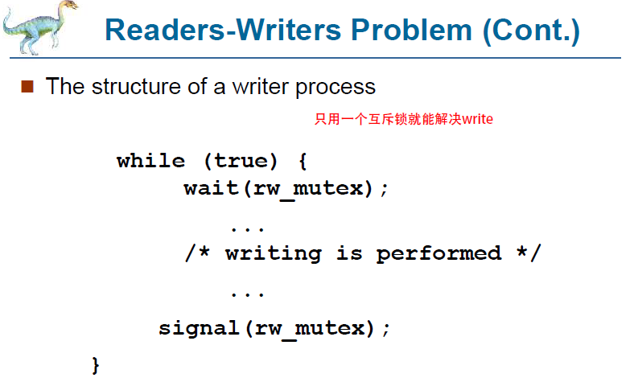
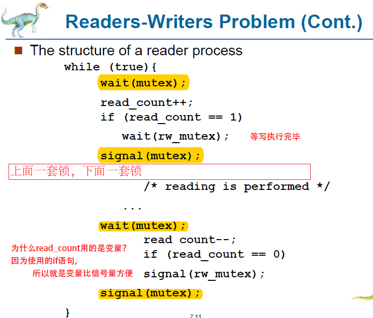

# Homework for Chapter7

### 7.8

> The Linux kernel has a policy that a process cannot hold a spinlock while attempting to acquire a semaphore. Explain why this policy is in place.

***ANSWER***

1. **Semaphore** suits the situation that the lock must be held for a long period. When a task tries to acquire a held semaphore, the semaphore will push the task into a waiting queue and sleep it. Then the processor can execute other code freely. When the process which held the semaphore is released, the task in the waiting queue will be wake, and acquire this semaphore.
2. While **spinlock** suits the situation only when a lock is held for a short duration. Spinlock do not allow task sleeping, since sleeping may lead to reschedule the kernel task and acquire the lock it has held.  

In this case, we can not hold a spinlock while we attempt to a semaphore, it is because we have to sleep while waiting for the semaphore, and by holding spinlock, we can not sleep.


### 7.11

> Discuss the tradeoff between fairness and throughput of operations in the readers–writers problem. Propose a method for solving the readers–writers problem without causing starvation.

***Answer***

1. ***Original Write Process***

   

   ***Original Read Process***

   From the code, we can easily find that multiple simultaneous readers opposed to single exclusive writer access to the shared date, which increases the throughput, while it may leads to less fairness and could cause starvation.

2. We could use the similar concept of aging in the priority scheduling. Once the writer updates the shared data, it will wake up the longest-duration-waiting task(longest time witch means highest priority). This operation can help fairness.

### 7.16

> The C program `stack-ptr.c` (available in the source-code download) contains an implementation of a stack using a linked list. An example of its use is as follows:
>
> ```c
> StackNode *top=NULL;
> push(5,&top);
> push(10,&top);
> push(15,&top);
> 
> int value = pop(&top);
> value=pop(&top);
> value=pop(&top);
> ```
>
> This program currently has a race condition and is not appropriate for a concurrent environment. Using Pthreads mutex locks (described in Section 7.3.1), fix the race condition.

***Answer***

**Solution1: Using mutex in the main()**

Actually, this problem is when multiple process want to push and pop at same time, how could we definite the operation.

```c
#include <pthread.h>

pthread_mutex_t mutex;

/* create and initialize the mutex lock */
pthread mutex init(&mutex,NULL);

/* acquire the mutex lock */
pthread mutex lock(&mutex);

/* critical section */
StackNode *top=NULL;
push(5,&top);
push(10,&top);
push(15,&top);


int value = pop(&top);
value=pop(&top);
value=pop(&top);

/* release the mutex lock */
pthread mutex unlock(&mutex);
```

From my understanding, it is easy to operate after finishing the project.

We can initialize a mutex, and lock it before the critical section, and then we enter the critical section, then unlock the mutex. In this case, it can promise the operations will not face race condition.

**Solution2: concurrent stack with mutex**

According to the website and stack given by TA in the wechat group, I rewrite the code of `push()` and `pop()` as follow to make this stack concurrent.

```c
void push(int i) {
    pthread mutex lock(&mutex);
    
    if (p1 == (tos + MAX_SIZE)) {
        pthread mutex unlock(&mutex);
        printf("\nStatus : Stack Overflow.\n");
    } else {
        *p1 = i;
        printf("\nPush Value : %d ", *(p1));
        p1++;
        pthread mutex unlock(&mutex);
    }
}
```

```C
void pop(void) {
    pthread mutex lock(&mutex);
    if (p1 == tos) {
        pthread mutex unlock(&mutex);
        printf("\nStatus : Stack Underflow.\n");
        //return 0;
    } else {
        p1--;
        pthread mutex unlock(&mutex);
        printf("\nPop Value : %d ", *(p1));
    }
}
```

