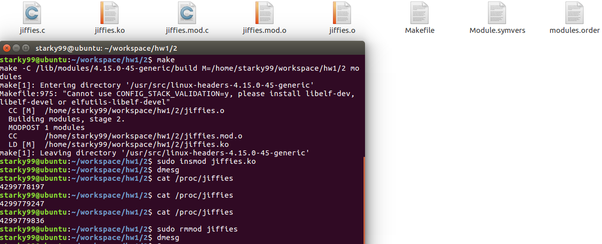
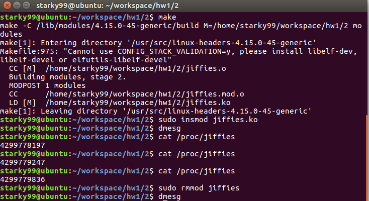
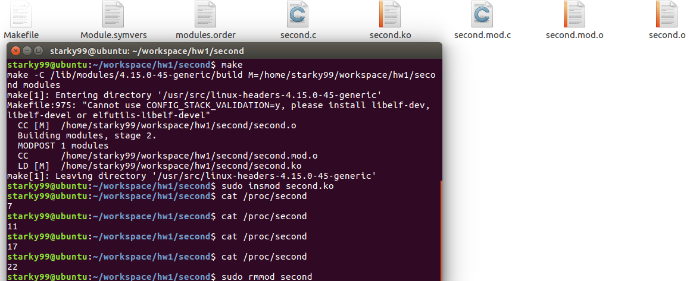
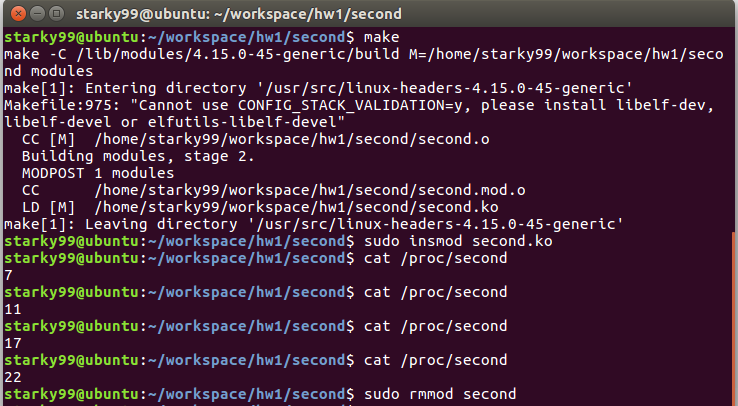

# EI338 Project1

## Project Environment

I use Ubuntu 16.04 in VMware.

## 1. Jiffies

### Question

Design a kernel module that creates a `/proc` file named `/proc/jiffies` that reports the current value of jiffies when the `/proc/jiffies` file is read, such as with the command

> cat /proc/jiffies

Be sure to remove `/proc/jiffies` when the module is removed.

### Answer

At the beginning of code, we should include `<linux/jiffies.h>`, because we will use jiffies from this head file. 

##### `/proc` File System

The `/proc` file system is a “pseudo” file system that exists only in kernel memory and is used primarily for querying various kernel and per-process statistics.

##### proc_init()

```c
/* This function is called when the module is loaded. */
int proc_init(void)
{
/* creates the /proc/jiffies entry */
	proc_create(PROC_NAME, 0666, NULL, &proc_ops);
	
	return 0;
}
```

This fuction create the new `/proc/jiffies` entry using the `proc_create()` , and passed `proc_ops`, which contains a reference to a struct file-operations. This struct initializes the `.owner` and `.read` members. The value of `.read` is the name of the function `proc_read()` that is to be called whenever `/proc/jiffies` is read.

##### proc_exit(void)

```c
/* This function is called when the module is removed. */
void proc_exit(void)
{
	/* removes the /proc/jiffies entry */
	remove_proc_entry(PROC_NAME, NULL);
}
```

The `/proc/jiffies` file is removed in the module exit point `proc_exit() `using the function `remove_proc_entry()`.

##### proc_read()

```c
/* This function is called each time /proc/jiffies is read */
ssize_t proc_read(struct file *file, char __user *usr_buf, size_t count, loff_t *pos)
{
	int rv = 0;
	char buffer[BUFFER_SIZE];
	static int completed = 0;
	
	if (completed) {
		completed = 0;
		return 0;
	}
	
	completed = 1;
	
	rv = sprintf(buffer, "%lu\n", jiffies);
	
	/* copies kernel space buffer to user space usr buf */
	copy_to_user(usr_buf, buffer, rv);
	
	return rv;
}
```

In this fuction,  we write the unsigned long int `jiffies` into the variable buffer where buffer exists in kernel memory. Since `/proc/jiffies` can be accessed from user space, we must copy the contents of buffer to user space using the kernel function `copy_to_user()`. This function copies the contents of kernel memory buffer to the variable `usr_buf`, which exists in user space. 

Each time the `proc/jiffies` file is read, the `proc_read()` function is called repeatedly until it returns 0, so there must be logic to ensure that this function returns 0 once it has collected the data that is to go into the corresponding `/proc/jiffies` file.

##### Makefile

```makefile
obj-m += jiffies.o
all:
	make -C /lib/modules/$(shell uname -r)/build M=$(PWD) modules
clean:
	make -C /lib/modules/$(shell uname -r)/build M=$(PWD) clean
```

Actually, this part of code is easy, and directly from the demo code.

### Result Picture



```shell
starky99@ubuntu:~/workspace/hw1/2$ make
make -C /lib/modules/4.15.0-45-generic/build M=/home/starky99/workspace/hw1/2 modules
make[1]: Entering directory '/usr/src/linux-headers-4.15.0-45-generic'
Makefile:975: "Cannot use CONFIG_STACK_VALIDATION=y, please install libelf-dev, libelf-devel or elfutils-libelf-devel"
  CC [M]  /home/starky99/workspace/hw1/2/jiffies.o
  Building modules, stage 2.
  MODPOST 1 modules
  CC      /home/starky99/workspace/hw1/2/jiffies.mod.o
  LD [M]  /home/starky99/workspace/hw1/2/jiffies.ko
make[1]: Leaving directory '/usr/src/linux-headers-4.15.0-45-generic'

starky99@ubuntu:~/workspace/hw1/2$ sudo insmod jiffies.ko
starky99@ubuntu:~/workspace/hw1/2$ dmesg

starky99@ubuntu:~/workspace/hw1/2$ cat /proc/jiffies 
4299778197

starky99@ubuntu:~/workspace/hw1/2$ cat /proc/jiffies 
4299779247

starky99@ubuntu:~/workspace/hw1/2$ cat /proc/jiffies 
4299779836

starky99@ubuntu:~/workspace/hw1/2$ sudo rmmod jiffies 
starky99@ubuntu:~/workspace/hw1/2$ dmesg
```



---

## 2. second

### Question

Design a kernel module that creates a proc file named `/proc/seconds` that reports the number of elapsed seconds since the kernel module was loaded. This will involve using the value of `jiffies` as well as the HZ  rate. When a user enters the command

> cat /proc/seconds

your kernel module will report the number of seconds that have elapsed since the kernel module was first loaded. Be sure to remove `/proc/seconds` when the module is removed.

### Answer

Base on the first question and introduction from the book. This question is also easy.

We should use a new model to introduce the new variable `HZ` using the following code

```c
#include <asm/param.h>
```

And change the name of the files to `second`.

```c
#define PROC_NAME "second"
```

##### proc_init()

```c
/* This function is called when the module is loaded. */
int proc_init(void)
{
/* creates the /proc/second entry */
	proc_create(PROC_NAME, 0666, NULL, &proc_ops);
	t = jiffies;
	return 0;
}
```

In this fuction, when the file is created, we should store jiffies of this second using variable `t`.

##### proc_read()

```c
/* This function is called each time /proc/second is read */
ssize_t proc_read(struct file *file, char __user *usr_buf, size_t count, loff_t *pos)
{
	int rv = 0;
	char buffer[BUFFER_SIZE];
	static int completed = 0;
	
	if (completed) {
		completed = 0;
		return 0;
	}
	
	completed = 1;
	
	rv = sprintf(buffer, "%lu\n", (jiffies-t)/HZ);
	
	/* copies kernel space buffer to user space usr buf */
	copy_to_user(usr_buf, buffer, rv);
	
	return rv;
}
```

In this fuction, we just need to caluculate the time by division. With the knowledge of c language, it is very easy to realize.

```c
rv = sprintf(buffer, "%lu\n", (jiffies-t)/HZ);
```

What is a little bit difficult is that we need to learn how to formatted output, which is a little bit different from it in python.

### Result Picture





In the command line, we can see the second has been calculated and shown on the screen.

These pictures do not contain `s` in the output, but it is also very easy to add it.

Just change my former code to

```c
rv = sprintf(buffer, "%lus\n", (jiffies-t)/HZ);
```

can solve this problem.(I change it when I check my code with TA, while the pictures are out of date.)


